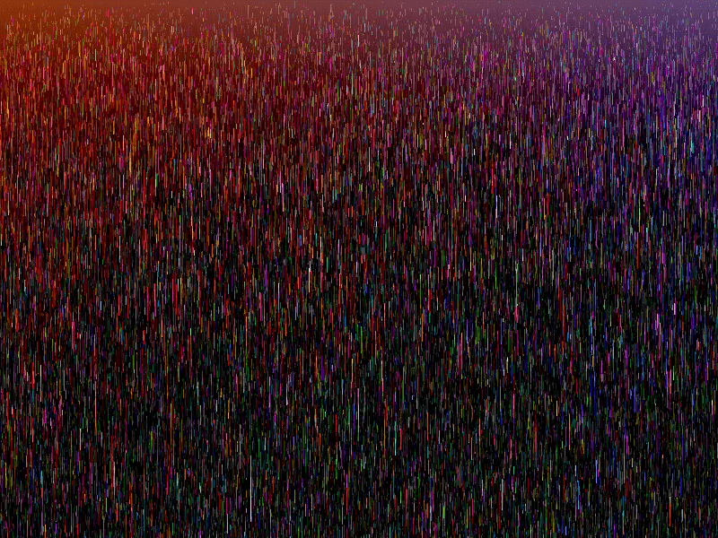
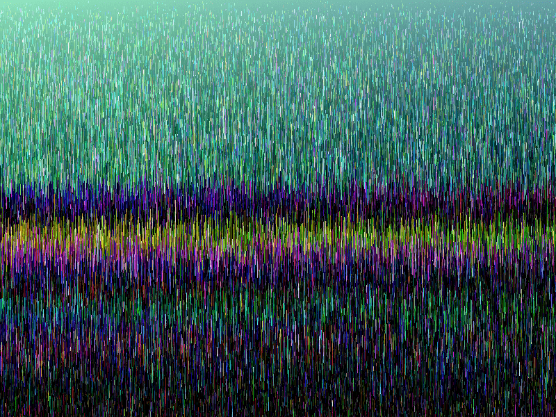

# PixelDrip ([high-res demo](http://share.bot.land/PixelDrip?w=800&h=600), [low-res demo](http://share.bot.land/PixelDrip?w=400&h=300))

PixelDrip is just a cool visualization:

# How to use

All you can do is click to generate a gradient of pixels at the top of the page.

The URL is customized with two parameters: `w` for the width of the canvas, and `h` for its height.

# How to build

Use any HTTP server to serve the files from your hard drive, e.g. [`http-server`](https://www.npmjs.com/package/http-server).

# Background

I made a program like this back in ~2006, but all I have left is a screenshot of the output (i.e. there was no code). I studied the screenshot to try to recreate the original program.

This was all hastily re-coded in about an hour, so I didn't aim for code quality.
